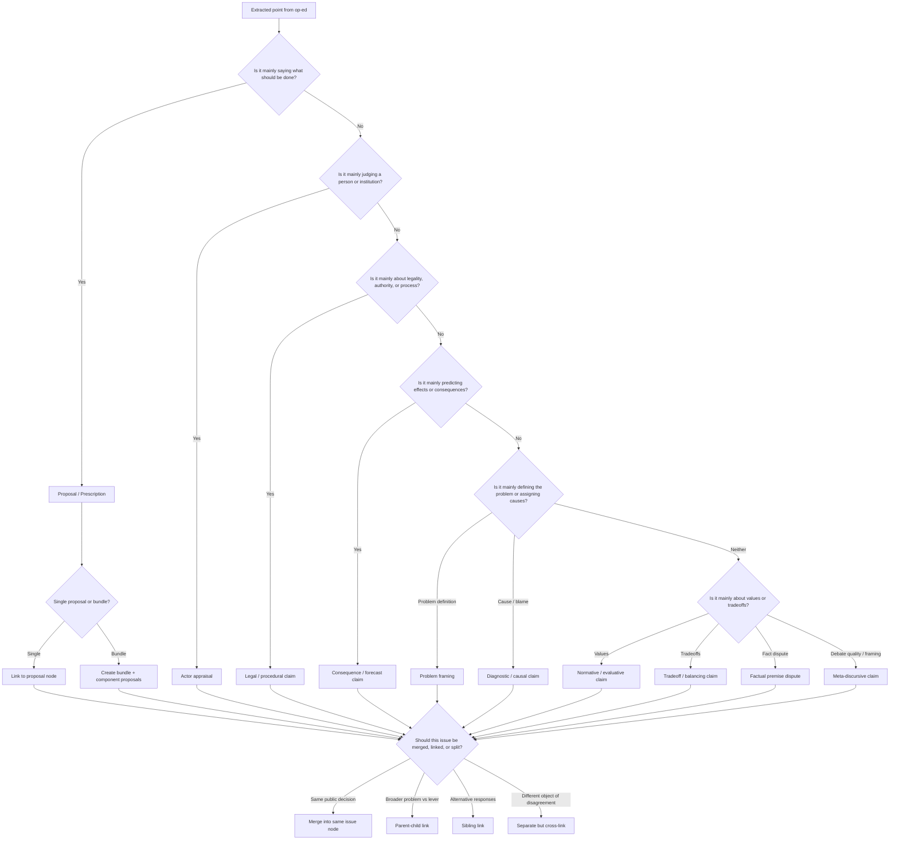

# A Generalized Taxonomy for Organizing Points Made in Op-Eds on Current Issues

## Purpose

This taxonomy is designed for **sorting, linking, and comparing argumentative points** in op-eds and public commentary about current affairs.

It is built for a system that wants to do more than just tag topics. It should help answer questions like:

- What kind of point is this?
- What larger issue does it belong to?
- Is it arguing about **ends**, **means**, **facts**, **values**, **tradeoffs**, or **people**?
- Is it best treated as a standalone issue, a sub-issue, or a sibling issue?
- Is it part of a bundled package of proposals?
- What other claims should it be linked to for comparison?

The aim is a taxonomy that is:

- **general** enough to apply across domains,
- **structured** enough to support downstream analysis,
- **modular** enough to handle bundled proposals and overlapping issue frames,
- **grounded** enough to work on live topics.

---

## Core design principle

The biggest mistake is to treat every op-ed as “about a topic.”

Most op-eds are actually making one or more of the following:

1. a **problem framing**,
2. a **diagnosis** of causes,
3. a **normative judgment**,
4. a **proposal**,
5. an **evaluation of a person or institution**,
6. a **forecast**,
7. a **tradeoff claim**, or
8. a **meta-argument** about process, legitimacy, or public reasoning.

So the primary organizing unit should not be just the **topic**. It should be the combination of:

- **Issue / issue cluster**
- **Argument object type**
- **Position / stance**
- **Relationships to adjacent claims and proposals**

---

## Recommended data model

### Issue, question, decision object, and proposal

To avoid collapse—especially when many op-eds implicitly answer **different prompts** inside the same headline topic—use these definitions:

| Concept | Role | Example |
| ------- | ---- | ------- |
| **Issue** | The real-world **controversy or problem area** (what the public fight is _about_). | High inflation; U.S. policy in the Iran war; future of Brooklyn Marine Terminal. |
| **Question** | The **specific debatable prompt** an op-ed is answering (often several per issue cluster). | “What should the Fed do with rates?” vs “What should be done about inflation?”—same cluster, different granularity. |
| **Decision object** | A **concrete** artifact or venue where a choice is or will be recorded: bill, ballot measure, agency docket, approved plan, executive order, court case. | A specific rate decision; the BMT Vision Plan as a vote item. |
| **Proposal** | A **candidate action or answer** in that space (may target a bundle, a component, or an end without endorsing current means). | Cut 25 bps; approve plan with conditions; seek a ceasefire. |

**High inflation**, **what should be done about high inflation**, and **what should the Fed do with rates** are at different levels: the second is usually a **question** under the first **issue**; the third is a **narrower question** (a lever), often **parent–child linked** to the broader one—not merged into one undifferentiated “topic.”

### 1. Issue node

An **issue node** is the controversy or problem area public debate is “about” (see table above). It is **not** the same as a single debatable question, nor the same as an official decision object.

Examples:

- High inflation
- What the Fed should do with interest rates _(often modeled as a **question** or child issue linked to the inflation issue)_
- U.S. military action against Iran
- Redevelopment of Brooklyn Marine Terminal
- Congestion pricing in New York City

Each issue node should have:

- **Canonical title**
- **Short description**
- **Domain**: foreign policy, local development, public health, macroeconomics, education, etc.
- **Geography**
- **Time horizon**: immediate, near-term, long-term
- **Institutional arena**: Congress, White House, city council, ballot, court, Fed, market actors, etc.
- **Parent / child / sibling relations**
- **Status**: active controversy, pending decision, implemented, litigated, historical reference, dormant
- **Linked questions**: explicit debatable prompts under this issue (optional but recommended when one issue hosts several distinct “asks”)
- **Links to decision objects**: ballots, bills, dockets, official plans (see canonical template)—distinct from the issue’s abstract framing

### 2. Argument unit

An **argument unit** is the atomic point extracted from an op-ed.

Each unit should have:

- **Text span / quote**
- **Claim summary**
- **Argument object type**
- **Claim role** (rhetorical role): how central the point is to the piece—e.g. **core thesis**, **supporting reason**, **rebuttal**, **concession**, **analogy**, **illustrative example**; at minimum a lightweight **centrality**: central / supporting / peripheral (op-eds mix many secondary claims; treating everything as equally central adds noise).
- **Target issue node** (and, when relevant, **target question** within that issue)
- **Position / stance**
- **Speaker / source**
- **Target actor or institution**, if any
- **Evidence style**: moral, empirical, legal, historical analogy, expert authority, procedural, strategic, etc.
- **Interpretive ambiguity** (is the author’s position hard to pin down?)—separate from—
- **Premise / factual uncertainty** (the author’s position may be clear, but the underlying facts are disputed or unknown). Do **not** collapse these into a single score.

### 3. Proposal node

A **proposal node** is a structured candidate action.

**Ends and means** deserve first-class fields—not only narrative rules—because much disagreement is shared-end / different-means, different-end / shared-means, or dispute over whether the **stated** end is the **real** end:

- **Claimed end(s)** (security, affordability, deterrence, housing supply, etc.)
- **Proposed means** (the action advocated)
- **Opposed means** (when the writer rejects a specific instrument but not necessarily the goal)
- **Alternative means** (when the writer substitutes another path to the same or a revised end)

Examples:

- Raise rates 25 bps
- Launch airstrikes on Iranian nuclear sites
- Negotiate a ceasefire with conditions
- Approve the Brooklyn Marine Terminal Vision Plan
- Revise the BMT plan before approval

Each proposal node should have:

- **Action verb**
- **Actor responsible**
- **Object of action**
- **Scope**
- **Time horizon**
- **Current status**: hypothetical, advocated, introduced, on ballot, under review, adopted, implemented, blocked
- **Links to official or canonical source pages**
- **Links to alternatives / sibling proposals**
- **Links to component sub-proposals if bundled**

### 4. Relation edge

Most of the value comes from **links** between claims—this is where comparison of **structures of reasoning**, not only positions, becomes possible.

Important relation types:

- **supports**
- **opposes**
- **qualifies**
- **assumes**
- **predicts consequence of**
- **is alternative to**
- **is sub-proposal of**
- **is implementation detail of**
- **is about legitimacy/process of**
- **is about actor fitness rather than policy substance**
- **shares root problem with**
- **depends on factual premise**
- **answers question** (claim or proposal targets a specific debate prompt)
- **advances end** / **undermines end** (relative to a stated goal)
- **uses means** / **rejects means** (instrument linkage)
- **rebuts** / **concedes** (argument-to-argument)
- **same end as** / **different end than** (for clustering compatible goals)
- **different level of abstraction than** (e.g. broad inflation issue vs Fed-rates lever)
- **instantiates** (example or case that embodies a broader claim)

---

## Top-level taxonomy of argument object types

This is the conceptual heart of the system.

**Full ontology vs v1:** The twelve types below are the **full** ontology for analysis and synthesis. For **first-pass annotation**, use the smaller **v1 operational set** in [Minimal practical taxonomy to start with](#minimal-practical-taxonomy-to-start-with)—keep the full list as the target, but stage rollout to reduce drift and labeling fatigue.

### A. Problem framing

These claims say **what the issue really is**.

Examples:

- “Inflation is primarily a cost-of-living crisis.”
- “The real issue is not Iran’s behavior alone but regional deterrence credibility.”
- “The Brooklyn Marine Terminal debate is fundamentally about public land and working waterfront preservation.”

Use when the point is defining:

- what counts as the core problem,
- what should be foregrounded,
- who is most affected,
- what scale the issue should be viewed at.

Subtypes:

- **scope framing**
- **moral framing**
- **institutional framing**
- **urgency framing**
- **distributional framing**

### B. Diagnostic / causal claim

These claims say **why the problem exists** or **what is driving it**.

Examples:

- “Inflation is being driven by excess demand.”
- “Escalation with Iran happened because deterrence failed.”
- “Red Hook’s infrastructure weakness is a legacy of underinvestment.”

Subtypes:

- root cause
- contributing factor
- blame assignment
- systems explanation
- historical cause

### C. Normative / evaluative claim

These claims say **what is good, bad, just, fair, legitimate, prudent, reckless, humane, democratic, etc.**

Examples:

- “A preventive war is morally indefensible.”
- “It is unjust to use public land mainly for luxury housing.”
- “The Fed should tolerate somewhat higher inflation to protect employment.”

Subtypes:

- moral judgment
- fairness / equity claim
- legitimacy claim
- prudence claim
- democratic accountability claim

### D. Proposal / prescription

These claims say **what should be done**.

Examples:

- “The Fed should cut rates.”
- “The U.S. should seek an off-ramp and negotiated ceasefire.”
- “The BMT plan should be approved.”
- “The BMT plan should be revised before any vote.”

Subtypes:

- policy proposal
- institutional reform
- tactical step
- sequencing proposal
- veto / pause / repeal proposal
- bundled platform

### E. Implementation / design claim

These claims accept a broad proposal but argue over **how it should be designed or implemented**.

Examples:

- “Rate cuts should be gradual rather than aggressive.”
- “Any Iran off-ramp should preserve deterrence and protect shipping lanes.”
- “Redevelopment should include binding port commitments, resiliency, governance safeguards, and affordability requirements.”

Subtypes:

- implementation detail
- guardrail
- eligibility criterion
- funding mechanism
- governance structure
- enforcement design

### F. Consequence / forecast claim

These claims say **what will happen** if a proposal or situation continues.

Examples:

- “Rate cuts now would reignite inflation.”
- “Continuing the war will raise oil prices and expand regional conflict.”
- “Approving the terminal plan will unlock jobs, housing, and resilience.”

Subtypes:

- intended benefit
- unintended consequence
- second-order effect
- geopolitical consequence
- electoral consequence
- economic consequence

### G. Tradeoff / balancing claim

These claims say **two or more goods cannot all be maximized at once**.

Examples:

- inflation versus employment
- deterrence versus escalation risk
- housing versus maritime industrial preservation
- speed versus democratic process

Subtypes:

- efficiency vs equity
- liberty vs safety
- growth vs stability
- national interest vs international law
- development vs preservation

### H. Factual premise dispute

These claims dispute the **underlying facts** that other arguments depend on.

Examples:

- “Iran is close to a nuclear threshold” versus “that threat is overstated.”
- “The terminal plan really preserves maritime use” versus “it functionally displaces it.”
- “Inflation is already defeated” versus “inflation remains sticky.”

Subtypes:

- empirical disagreement
- measurement dispute
- forecast baseline dispute
- legal-factual dispute

### I. Legal / constitutional / procedural claim

These claims focus on **authority, legality, process, and institutional rules**.

Examples:

- “The president lacks authority to continue hostilities without Congress.”
- “Attacks on civilian infrastructure may violate international humanitarian law.”
- “This redevelopment process lacks adequate public input or governance clarity.”

Subtypes:

- jurisdiction / authority
- due process
- statutory interpretation
- constitutional claim
- international law claim
- procedural legitimacy

### J. Actor appraisal

These claims are primarily about **the character, judgment, motives, competence, or fitness** of a person or institution.

Examples:

- “Trump is acting impulsively.”
- “The Fed has lost credibility.”
- “The city cannot be trusted to protect the working waterfront.”

This is distinct from a policy claim. It may support one, but the object is the actor.

Subtypes:

- competence
- integrity
- motives
- leadership style
- temperament
- credibility

### K. Coalition / political strategy claim

These claims focus on **what is politically possible**, how constituencies align, and how power is being assembled.

Examples:

- “A ceasefire position is becoming politically necessary because public support for the war is weak.”
- “The BMT coalition only holds together if housing and maritime labor both get visible wins.”

Subtypes:

- electoral viability
- coalition maintenance
- messaging strategy
- bargaining leverage
- institutional path dependence

### L. Meta-discursive claim

These claims are about **how the debate itself is being conducted**.

Examples:

- “The debate is being distorted by panic.”
- “Critics are conflating support for redevelopment with support for displacement.”
- “This issue is being framed too narrowly as war versus appeasement.”

Subtypes:

- framing critique
- media critique
- epistemic standards claim
- discourse quality claim

### Disambiguation: problem framing vs normative vs meta-discursive

Annotators often blur **“the real issue is Y,”** **“it is wrong to focus on Z,”** and **“the debate is wrongly framed as X.”** Use these **use-this-when** rules:

| Type | Use when the point is… | Typical move |
| ---- | ---------------------- | ------------ |
| **Problem framing** | Defining **what the issue is fundamentally about**—scope, scale, who is affected, what counts as the core problem. | “The real fight is deterrence, not regime change.” |
| **Normative / evaluative** | Saying something is **good, bad, just, reckless, legitimate, humane**—a moral or prudential verdict on an action, outcome, or state of affairs. | “Preventive war is morally indefensible.” |
| **Meta-discursive** | Commenting on **how the public debate is being framed, conducted, or distorted**—not primarily on first-order policy substance. | “Pundits are conflating X with Y”; “this is being framed as war vs appeasement.” |

If a sentence does two jobs (e.g. reframes _and_ judges), assign a **primary** type and optionally a **secondary** type—see Rule 6 in [Practical policy rules](#practical-policy-rules-for-a-production-system).

---

## Position schema

For each argument unit, assign a position at the right level.

### For proposals

- **for**
- **against**
- **for with conditions**
- **for in principle, against current version**
- **prefer alternative**
- **unclear / mixed**

### For actor appraisal

- positive
- negative
- mixed
- comparative preference

### For factual disputes

- affirms premise
- denies premise
- reframes premise
- says uncertainty is too high

### For normative claims

- just / unjust
- prudent / imprudent
- legitimate / illegitimate
- democratic / undemocratic
- humane / inhumane

---

## How to decide whether issues should be merged, linked, or split

This is one of the most important policy decisions for the taxonomy.

## 1. Merge issues when the public question is effectively the same decision

Merge when:

- the same decision-maker is deciding the same thing,
- the same proposal set answers both phrasings,
- op-eds usually treat them as interchangeable,
- splitting them would create artificial duplication.

Example:

- “Should the city approve the BMT Vision Plan?”
- “Should Brooklyn Marine Terminal be redeveloped under the current plan?”

These likely belong to the **same main issue node**.

## 2. Link as parent-child when one issue is a broader problem and the other is a lever

Use parent-child when one issue is the broad social problem and the other is a more specific policy instrument.

Example:

- Parent: **What should be done about high inflation?**
- Child: **What should the Fed do with interest rates?**

They should usually **not** be merged, because the first includes fiscal policy, supply-side remedies, wage dynamics, regulation, and distributional responses, while the second is a narrower institutional lever.

## 3. Link as siblings when they are alternative responses to the same root problem

Example:

- Increase rates
- Use targeted fiscal relief
- Expand supply
- Impose price controls

These are sibling proposal families under the broader issue of inflation.

## 4. Split when disagreement is really about different objects

Do not collapse these into one issue:

- “Is the war justified?”
- “Is Trump fit to manage the war?”
- “Is the war legal?”

These are tightly related, but they concern **different objects**:

- policy substance,
- actor fitness,
- legal authority.

They should be linked, not merged.

## 5. Create issue clusters for recurring complexes

Some controversies reliably appear as bundles of partially separable issues. For these, create an **issue cluster**.

Examples:

- war aims
- legality
- civilian harm
- exit strategy
- deterrence credibility
- alliance politics

or:

- land use
- housing
- industrial preservation
- labor
- resiliency
- governance
- community process

---

## Bundled proposals

Many real-world plans are bundles rather than single proposals.

A bundle should be modeled as:

- **bundle proposal node**
- linked **component proposal nodes**
- claims that may target either the bundle as a whole or specific components

### Recommended bundle rules

#### Treat as a bundle when

- advocates present the plan as a package,
- components can be separately supported or criticized,
- tradeoffs within the package matter.

#### Store at least three levels

1. **Bundle-level stance**
2. **Component-level stance**
3. **Rationale for coupling**

#### Coupling objections (distinct from component objections)

Sometimes a writer supports **components A and B** on the merits but opposes **bundling A+B**—the objection targets **package logic** (omnibus legislation, foreign-policy packages, budget deals, urban plans), not necessarily any single element. Model this explicitly, e.g.:

- support component A
- support component B
- **oppose coupling** A+B (or oppose the package _as a package_)

This is common in urban policy, foreign-policy “deals,” and legislative omnibuses.

### Example: Brooklyn Marine Terminal

Possible bundle structure:

- Approve BMT redevelopment vision plan
- modernize port / maritime facilities
- build housing
- create open space
- deliver resiliency infrastructure
- create industrial / workforce / cultural space
- set governance / oversight structure

A writer may:

- support the bundle,
- support only the maritime and resiliency components,
- oppose the housing component,
- support redevelopment in principle but oppose the current bundle design.

This is why “for / against the plan” alone is too crude.

---

## Suggested tagging dimensions for every claim

Each argument unit should ideally be tagged along these dimensions:

| Dimension | Examples |
| --------- | -------- |
| Domain | foreign policy, macroeconomics, local development |
| Issue level | root issue, sub-issue, proposal, implementation |
| Object type | proposal, diagnosis, actor appraisal, legal claim |
| Target actor | president, Fed, Congress, city, EDC, voters |
| Normative axis | justice, prudence, democracy, security, prosperity |
| Time horizon | immediate, medium-term, long-term |
| Evidence mode | moral, empirical, legal, strategic, historical analogy |
| Affected group | workers, residents, taxpayers, civilians, allies |
| Geographic scope | local, national, regional, global |
| Uncertainty level | low, medium, high (for **factual** premise strength) |
| Interpretive clarity | is the author’s position clear? (distinct from factual uncertainty) |

---

## Decision tree for classifying a point

---

## Canonical issue-family template

For each major live controversy, organize around this scaffold:

### 1. Root issue

The broad public question.

### 2. Sub-issues

Distinct but related questions nested under the root issue.

### 3. Proposal set

The main competing actions on the table.

### 4. Argument map

Claims sorted by object type:

- problem framings
- diagnostic claims
- normative claims
- proposals
- implementation/design claims
- consequence forecasts
- legal/procedural claims
- actor appraisals
- coalition/political claims
- meta-discursive claims

### 5. Official decision objects

Where relevant, attach:

- ballot measure page
- bill page
- agency docket
- executive order
- court case
- municipal plan page
- official project page

### 6. Alternatives / siblings

What else could plausibly be done instead?

### 7. Bundle decomposition

If the proposal is a package, what are the major components?

---

## Grounding example 1: the 2026 U.S.–Iran war

### Root issue (U.S.–Iran war)

**What should the United States do in the current war with Iran?**

### Useful sub-issues (U.S.–Iran war)

- Is the war justified on the merits?
- What should the U.S. objective be?
- Should the U.S. escalate, hold course, or seek an off-ramp?
- Is the conduct of the war lawful?
- Is Trump handling the war competently?
- What are the likely regional and economic consequences?

### Proposal family examples (U.S.–Iran war)

- continue current military campaign
- escalate strikes
- avoid ground invasion while maintaining air campaign
- seek negotiated ceasefire / off-ramp
- narrow objectives to specific deterrence goals
- withdraw on an accelerated timeline

### Why this example is useful for the taxonomy (U.S.–Iran war)

This topic clearly separates:

- **proposal claims**: escalate, de-escalate, negotiate, withdraw,
- **actor claims**: whether Trump is fit or impulsive,
- **legal claims**: authority and war-crimes arguments,
- **forecast claims**: oil prices, casualties, regional spillover,
- **factual premise disputes**: Iranian capabilities, war aims, likely success.

That makes it a good example of why adjacent issues should often be **linked rather than merged**.

### Suggested issue-graph treatment (U.S.–Iran war)

- Main issue: **U.S. policy toward the war**
- Linked legal issue: **lawfulness of U.S. actions**
- Linked actor issue: **presidential competence / judgment**
- Linked consequence issue: **regional and economic spillovers**

### Example tags for op-ed points (U.S.–Iran war)

| Claim summary | Type | Best issue placement |
| ------------- | ---- | -------------------- |
| “The U.S. should seek an off-ramp now.” | Proposal | Main war-policy issue |
| “Continuing the war will raise oil prices and widen regional instability.” | Consequence / forecast | Linked consequence issue |
| “Attacks on civilian infrastructure may violate international law.” | Legal / procedural | Linked legality issue |
| “Trump’s shifting war aims show poor judgment.” | Actor appraisal | Linked actor-competence issue |
| “The real issue is restoring deterrence, not regime change.” | Problem framing | Main war-policy issue |

---

## Grounding example 2: Brooklyn Marine Terminal redevelopment

### Root issue (Brooklyn Marine Terminal)

**What should happen to the Brooklyn Marine Terminal site?**

### Useful sub-issues (Brooklyn Marine Terminal)

- Should the current vision plan be approved?
- How much maritime use should be preserved or expanded?
- How much housing should be included, and of what type?
- What resiliency infrastructure is needed?
- What governance and accountability structure should oversee implementation?
- Has the process been sufficiently community-driven and legitimate?

### Proposal family examples (Brooklyn Marine Terminal)

- approve the plan as advanced
- approve with conditions / revisions
- delay approval and revise
- prioritize maritime and industrial uses over housing
- increase affordability and governance safeguards
- redesign for stronger resiliency and transportation commitments

### Why this example is useful for the taxonomy (Brooklyn Marine Terminal)

This topic is a classic **bundle case**. The controversy is not just “for or against redevelopment.” It includes debate over:

- maritime preservation,
- housing,
- open space,
- resiliency,
- labor,
- governance,
- community process.

A strong taxonomy should therefore let a writer be:

- for redevelopment,
- against the current plan,
- for only some components,
- or focused mainly on process legitimacy.

### Suggested issue-graph treatment (Brooklyn Marine Terminal)

- Main issue: **future of the BMT site**
- Bundle proposal: **current vision plan**
- Components:
- maritime modernization
- housing
- open space
- resiliency
- industrial/workforce/community space
- governance / oversight

- Linked process issue: **legitimacy and adequacy of public engagement / governance**

### Example tags for op-ed points (Brooklyn Marine Terminal)

| Claim summary | Type | Best issue placement |
| ------------- | ---- | -------------------- |
| “The plan should not be approved until governance and transportation questions are resolved.” | Proposal with conditions | Main issue / bundle node |
| “A working waterfront must remain central to any redevelopment.” | Normative / evaluative + problem framing | Main issue |
| “The current process has not adequately addressed community concerns.” | Legal / procedural or normative legitimacy claim | Linked process issue |
| “The project can deliver jobs, housing, and resilience at once.” | Consequence / forecast | Bundle node |
| “Public land should not be leveraged without stronger affordability guarantees.” | Normative / evaluative | Housing component or bundle node |

---

## Practical policy rules for a production system

## Rule 1: Keep “topic” and “object of disagreement” separate

Two op-eds can be about the same headline topic but disagree about different objects:

- policy substance
- legality
- competence
- consequences
- moral legitimacy

Do not flatten those.

## Rule 2: Prefer smaller issue nodes plus strong links over giant omnibus issues

Large omnibus issues become unusable. Better to maintain:

- a root issue,
- several linked sub-issues,
- explicit relation types.

## Rule 3: Treat proposals as first-class objects

The system should not only classify “this article is about Iran.” It should know:

- what action is being advocated,
- by whom,
- against what alternatives,
- under what conditions.

## Rule 4: Separate support for ends from support for means

Someone may support the same goal but reject the means.

Examples:

- support lowering inflation, oppose rate hikes
- support a secure Middle East, oppose war escalation
- support redevelopment, oppose the current BMT plan

This is essential.

## Rule 5: Explicitly support “for in principle, against current version”

This is common in op-eds and public letters.

Examples:

- pro-housing, anti-this-project
- pro-port modernization, anti-current-governance model
- pro-deterrence, anti-current-war strategy

## Rule 6: Support multi-labeling when a point genuinely spans categories

Some claims are dual-natured.

Example:

“Approving this plan without stronger oversight would be irresponsible.”

This is both:

- a proposal/design claim,
- and a normative/prudential judgment.

Allow one **primary** type plus optional **secondary** types.

## Rule 7: Keep official decision objects attached but conceptually distinct

A ballot measure, bill, plan document, or docket is not the same thing as the broader issue.

Store links from issue/proposal nodes to official decision objects, but do not collapse the concept into the document.

---

## Minimal practical taxonomy to start with

**Staged rollout:** Treat this as the **v1 operational** slice—enough for reliable first-pass labeling. The [twelve-type full ontology](#top-level-taxonomy-of-argument-object-types) remains the long-term target; add **tradeoff**, **coalition / political strategy**, and **meta-discursive** (or fold edge cases into framing / evaluation / diagnosis) when annotators are calibrated.

### Layer 1 — Debate objects (what exists in the world of the controversy)

- issue (and linked **questions** / sub-issues)
- proposal and **bundle proposal**
- **decision object** (bill, ballot, plan, docket, order, case)
- actor / institution

### Layer 2 — v1 operational claim types (classify each argument unit)

Start here before expanding to all twelve:

| v1 bucket | Maps to full ontology |
| --------- | --------------------- |
| framing | A. Problem framing |
| diagnosis | B. Diagnostic / causal |
| evaluation | C. Normative / evaluative |
| proposal | D. Proposal / prescription |
| design / implementation | E. Implementation / design |
| forecast | F. Consequence / forecast |
| fact dispute | H. Factual premise dispute |
| legality / process | I. Legal / constitutional / procedural |
| actor appraisal | J. Actor appraisal |

**Defer to v2 or merge carefully:** G (tradeoff), K (coalition / strategy), L (meta-discursive)—or introduce with extra training examples.

### Layer 3 — Relations (how claims connect)

Use the [expanded relation list](#4-relation-edge) in the data model; v1 can start with **supports**, **opposes**, **qualifies**, **parent / child / sibling**, **component of**, **alternative to**, **depends on factual premise**, **answers question**, and links to **legality / process / actor** side issues—then add **rebuts**, **concedes**, **same end as**, **uses means**, etc., as the graph matures.

### Primary issue objects (reference)

- issue
- sub-issue / **question**
- proposal
- bundle proposal
- actor
- official **decision object**

### Primary argument types (full list — post–v1)

- problem framing
- diagnostic / causal
- normative / evaluative
- proposal / prescription
- implementation / design
- consequence / forecast
- tradeoff / balancing
- factual premise dispute
- legal / procedural
- actor appraisal
- coalition / political strategy
- meta-discursive

### Primary relation types (reference)

- supports
- opposes
- qualifies
- alternative to
- parent of
- child of
- component of
- linked process issue
- linked legality issue
- linked actor issue
- depends on factual premise
- (see [Relation edge](#4-relation-edge) for the extended set)

---

## Final recommendation

The best generalized conceptual taxonomy is **not** a flat topic taxonomy. It is a **layered issue-and-argument taxonomy**.

A crisp stacking of the design:

1. **Debate objects** — issues, **questions**, proposals, bundles, **decision objects**, actors.
2. **Claim types** — argument object types (v1 starter set → full ontology).
3. **Relations** — edges that carry comparative and reasoning structure, not just co-mention.

At a high level:

1. Organize around **issue nodes** and make **debate prompts** explicit where op-eds diverge inside one cluster.
2. Treat **proposals** as explicit objects, with **ends and means** distinguished in the schema when relevant.
3. Classify each extracted point by **argument object type** and **claim role** (centrality).
4. Link neighboring but distinct questions rather than over-merging them.
5. Model **bundled plans** as bundles with components—and **coupling objections** where the package logic is the target.
6. Keep **interpretive ambiguity** and **factual uncertainty** separate; keep room for disagreements over **facts, values, legality, consequences, and people** separately.

In practice, this will let you represent the difference between:

- “This war is illegal.”
- “This war is unwise.”
- “Trump is unfit to manage this war.”
- “The U.S. should seek an off-ramp.”
- “An off-ramp would invite future aggression.”

or between:

- “Redevelopment is necessary.”
- “This redevelopment plan is flawed.”
- “The maritime component is too weak.”
- “The process lacks legitimacy.”
- “Housing on this site is justified only with stronger affordability guarantees.”

Those are all related. But they are **not the same kind of point**.

That distinction is the core of a strong taxonomy.

---

## Source grounding for the example topics

The live U.S.–Iran example is grounded in current reporting describing an active war, ongoing debate over escalation and off-ramps, and disputes over legality and consequences. The Brooklyn Marine Terminal example is grounded in the official Brooklyn Marine Terminal Vision Plan and public-engagement materials, as well as public criticism centered on process, governance, affordability, and maritime commitments.
